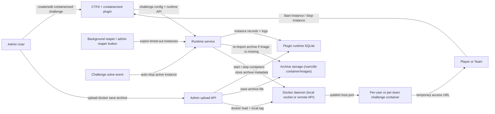

# CTFd Container Challenge Plugin PoC

This second PoC packages the container lifecycle flow as a real CTFd plugin instead of a standalone orchestrator dashboard.
It adds a custom `containerized` challenge type to CTFd, launches per-user containers through a local or remote Docker API, and cleans them up on solve or timeout.

## What is included

- Custom CTFd challenge type: `containerized`
- Docker-backed runtime API inside the plugin
- Explicit split between Docker control endpoint and player-facing runtime host
- Per-challenge controls for image, exposed port, CPU, memory, timeout, and concurrency
- Optional Docker archive upload for challenge images (`docker save` tarballs imported into the local Docker daemon)
- Optional published port range for fixed firewall exposure on a remote Docker host
- Idempotent start behavior for the same user/account
- Automatic timeout reaper
- Automatic stop when the challenge is solved
- Admin runtime page inside CTFd: `/admin/plugins/containerized-challenges`
- Admin controls to force-stop one running instance, stop all running instances for a challenge, and inspect each challenge's active resource profile
- Automated smoke tests for both same-host and split-host topologies

## Quick start

Prerequisites:

- Docker Desktop / Docker Engine running
- Docker Compose v2+

Run the same-host end-to-end smoke test:

```bash
cd POC-CTFd
./scripts/smoke_test.sh
```

Run the split-host end-to-end smoke test:

```bash
cd POC-CTFd
./scripts/smoke_test_split.sh
```

Open CTFd:

- [http://127.0.0.1:8001](http://127.0.0.1:8001)

The smoke test uses the existing demo image from [`../POC/challenges/demo-http`](../POC/challenges/demo-http) and validates the plugin against a live Dockerized CTFd instance.
The split smoke test simulates `CTFd VM -> remote Docker VM` with `docker:dind` and runs the player workflow from a dedicated smoke-runner container on the same network.
A real two-VM Lima validation was also completed; see `docs/03_real-vm-validation.md`.

## Architecture



## Runtime behavior

- Challenge instances are scoped per authenticated player in `users` mode.
- In `teams` mode, players need to belong to a team before they can launch an instance.
- Duplicate start requests reuse the already running instance.
- The plugin can control either a local Docker socket or a Docker daemon on another VM.
- Generated `access_url` values use `CTFD_CONTAINER_PUBLIC_HOST`, which can differ from `CTFD_CONTAINER_DOCKER_HOST`.
- Containers are launched with the same baseline hardening as the first PoC:
  - read-only root filesystem
  - dropped Linux capabilities
  - `no-new-privileges`
  - PID limit
  - CPU and memory limits
  - dedicated bridge network per instance
- Solving the challenge stops the active instance for that player.
- Expired instances are reaped automatically in the background.

## Challenge settings summary

| Setting | Purpose | Effect on runtime behavior |
| --- | --- | --- |
| `image` or uploaded archive | Selects the challenge container image | Determines which workload is started for each participant |
| `container_port` | Declares the service port inside the container | Used to publish a reachable host port back to the player |
| `CTFD_CONTAINER_DOCKER_HOST` | Selects the Docker control endpoint | Lets CTFd manage a local or remote Docker daemon |
| `CTFD_CONTAINER_PUBLIC_HOST` | Selects the player-facing runtime host | Determines which host is used in generated access URLs |
| `CTFD_CONTAINER_PUBLISHED_PORT_MIN` / `CTFD_CONTAINER_PUBLISHED_PORT_MAX` | Restrict the published port pool | Useful for remote-host firewall policy and predictable exposure |
| `cpu_limit` | Caps CPU consumption per instance | Prevents one challenge from monopolizing host CPU |
| `memory_limit_mb` | Caps memory usage per instance | Limits blast radius of runaway processes |
| `timeout_seconds` | Sets the maximum lifetime of an instance | Drives automatic cleanup by the reaper |
| `max_instances` | Caps concurrent active runtimes per challenge | Enforces back-pressure under peak demand |

## Admin controls

- The challenge create/edit screens expose per-challenge CPU, memory, timeout, port, image, and concurrency settings.
- Admins can either reference a normal Docker image name or upload a `.tar`, `.tar.gz`, or `.tgz` archive produced by `docker save`.
- Uploaded archives are stored in the plugin runtime volume and re-imported automatically if the local Docker image is later removed.
- The admin runtime page shows a configuration table for all `containerized` challenges so the effective resource profile is visible without opening each challenge editor.
- Admins can force-stop a single running instance or stop all active instances for a specific challenge from the runtime page.
- Admins can run the timeout reaper manually from the runtime page.
- The admin file picker accepts `.tar`, `.tar.gz`, `.tgz`, and explicit gzip MIME filters because some browsers otherwise hide `docker save` archives until "All files" is selected.
- Selecting an archive uploads it immediately and fills the image field with the imported local tag before the challenge form is saved.

## Stack layout

- `Dockerfile`: CTFd image with the plugin and Docker SDK installed
- `docker-compose.yml`: common base stack
- `docker-compose.local.yml`: same-host override using `/var/run/docker.sock`
- `docker-compose.split.yml`: split-host simulation using `docker:dind` plus a smoke-runner container
- `docs/01_split-host-deployment.md`: deployment notes for same-host and split-host operation
- `docs/02_validation-and-findings.md`: validation commands, findings, and resolved issues
- `docs/03_real-vm-validation.md`: actual two-VM Lima validation commands, results, and caveats
- `plugins/ctfd_container_challenges/`: plugin code, runtime service, admin page, and challenge assets
- `scripts/smoke_test.sh`: build, boot, and verify the same-host PoC
- `scripts/smoke_test_split.sh`: build, boot, and verify the split-host PoC
- `scripts/smoke_test.py`: shared HTTP-level end-to-end verification flow

## Notes

- The base Compose file no longer hardcodes a local Docker socket. Choose `docker-compose.local.yml` for same-host work or `docker-compose.split.yml` for the split-host simulation.
- The split-host simulation deliberately uses insecure Docker TCP (`2375`) because it is disposable local test infrastructure. A real deployment should use TLS or another protected control path.
- The documented real Lima validation also used insecure Docker TCP (`2375`) for disposable test infrastructure. Keep that out of any persistent or shared environment and use TLS for real deployments.
- The compose stack uses SQLite deliberately so the plugin can bootstrap cleanly through CTFd’s plugin migration path without extra database services.
- After changing plugin frontend assets, rebuild the stack with `docker compose up -d --build` and refresh the browser. The plugin now appends versioned asset URLs, but an already open tab can still show stale UI until it reloads.
