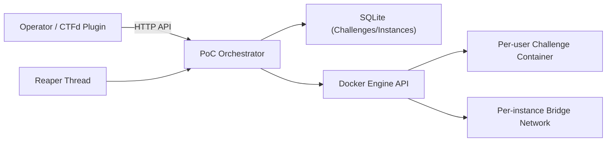

# PoC Architecture

## Components

- `Dashboard + API` (`app/poc_orchestrator/web.py`): operator UI and REST endpoints.
- `Service layer` (`service.py`): lifecycle rules, validation, quotas, timeout logic.
- `Storage` (`storage.py`): SQLite state for challenges and instances.
- `Container backend` (`backend.py`): Docker SDK operations.
- `Timeout reaper` (`reaper.py`): periodic expiration and cleanup.
- `Demo challenge image` (`challenges/demo-http/`): test workload.

## Flow

## Lifecycle summary

1. Register challenge template (`image`, `port`, `limits`, `timeout`, `max_instances`).
2. Start instance for `challenge_id + user_id`.
3. Backend creates isolated network + container.
4. API returns instance metadata + access URL.
5. Instance stops on manual request or timeout reaper.
6. Backend removes container and network; DB updates final status.
